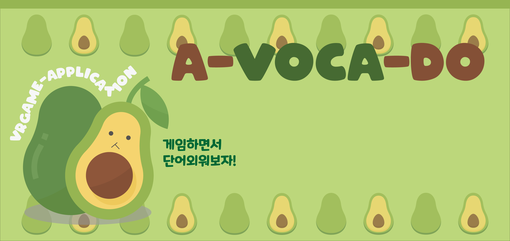

# :avocado: A-VOCA-DO : AR based Game application

## Application Explaination
  - significance : Increase educational effectiveness by increasing children's interest by using AR games.
  - target : 4-5 year-old children who study English



## Development Environment
  - Unity3D 2.17f1
  - Vuforia Engine (for AR)
  - C# (IDE : Visual Studio 2019)


## Developer
  - SaetByeol Ahn
  - SooMin Lee
  
## Platform
  - Mobile : Android ( standard resolution : Galaxy S10)


## Asset

```
Baker House/
Bed & Bath Furniture Pack/
BigFurniturePack/
Butterfly (Animated)/
Cartoon PalmTree and Umbrella/
Five Seamless Tileable Ground Textures/
NaturePackLite/
RainMaker/
Suriyun/
````
