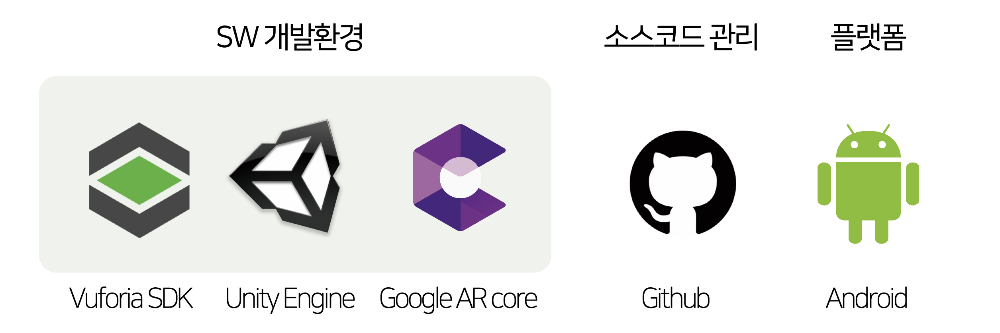

# :avocado: A-VOCA-DO : AR based Educational Application
> 이화여자대학교 캡스톤디자인프로젝트 졸업프로젝트 최우수상 <br>
> 디벨롭 후 제8회 실감콘텐츠 K-해커톤 수상
> 시연영상 [Link!](https://youtu.be/PW1_Xr0CeE4)


## Explanation 📄
  - __타겟 유저__ : 영어를 배우고 있는 만 4세 이상 아동
  - __개발 목적__ : 현실의 이미지와 실시간으로 인터랙션이 가능한 AR의 기술을 활용하여 학습자와 상호작용할 수 있는 교육용 어플리케이션 개발
  
  - __기대 효과__
    - 스토리텔링 방식으로 학습에 맥락성을 부여함으로써 학습자의 맥락 유추능력 강화
    - 어플리케이션 내 캐릭터와의 실시간 인터랙션을 시각화하여 학습자의 흥미 유발
    - 종이책과 AR을 융합하여 디지털 기기가 더욱 친숙한 알파세대가 종이책에 느끼는 거부감 감소
    
  - __발전 가능성__
    - 다양한 언어 및 발달단계에 따른 맞춤형 학습 어플리케이션으로 확대
    - 학습자의 선택에 따라 다양한 결말이 나오는 스토리로 확장
    - 언택트 문화와 교육의 온라인화 시대에 발맞추어 경쟁력 확보


## Development Environment ⚙️
  - Unity3D 2.17f1
  - Vuforia Engine
  - C# (IDE : Visual Studio 2019)



## Platform
  - Android (standard resolution : Galaxy S10)

## Developer
  - [SaetByeol Ahn](https://github.com/sbyeol3) 
  - [SooMin Lee](https://github.com/vilut1002)
  
## Asset

```
Baker House/
Bed & Bath Furniture Pack/
BigFurniturePack/
Butterfly (Animated)/
Cartoon PalmTree and Umbrella/
Five Seamless Tileable Ground Textures/
NaturePackLite/
RainMaker/
Suriyun/
````

## Copyright
> image : Flaticon kawaii png <br>
> fonts : 메이플스토리 무료폰트
